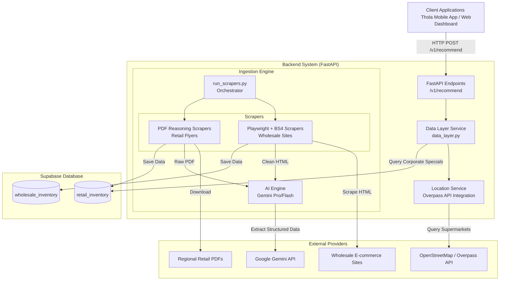
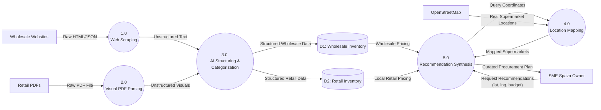
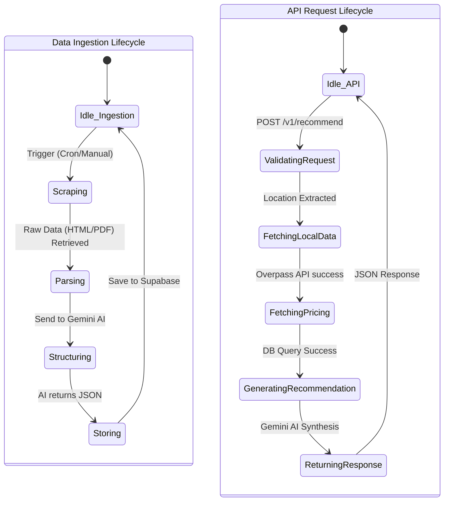
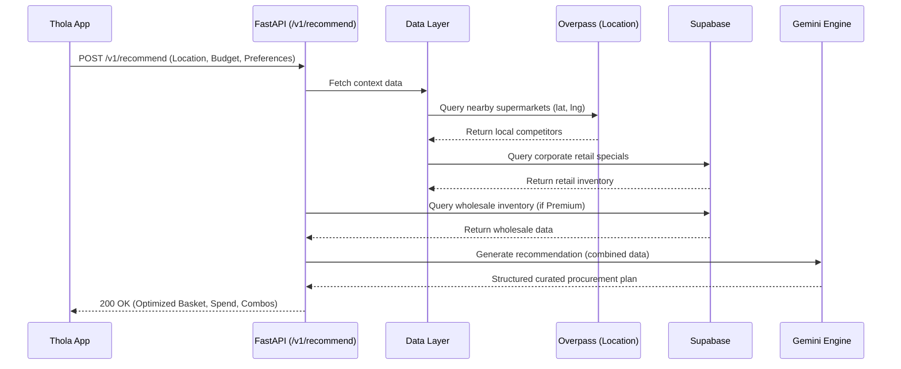

# Retail Intelligence System (RIS)

The Retail Intelligence System (RIS) is a modern, AI-powered backend microservice designed to harvest, process, store, and serve retail and wholesale intelligence. Developed as an API for the Thola Mobile application, it orchestrates web scraping, visual reasoning, geographic data aggregation, and AI-driven recommendations to help Small and Medium Enterprises (SMEs), particularly Spaza shop owners, make data-driven procurement and pricing decisions.

## 🚀 What the System Does

RIS operates in two primary phases:
1. **Ingestion Pipeline**: Asynchronously scrapes wholesale e-commerce sites (via Playwright) and parses regional retail promotional leaflets (via PDFs). It leverages Google Gemini AI to visually reason and extract structured data (item, price, category, etc.) from unstructured HTML and PDFs, storing the intelligence in Supabase.
2. **Serving Pipeline**: A Fast API backend that serves endpoints (e.g., `/v1/recommend`) which accept a user's location and budget. It queries local supermarket locations via the Overpass API (OpenStreetMap), cross-references this with the ingested corporate retail specials and wholesale prices, and uses Gemini AI to generate a curated procurement plan.

## 🏛️ System Architecture

The architecture decouples heavy asynchronous data ingestion from the fast user-facing API.

## 📊 Data Flow Diagram (DFD)

This diagram illustrates how raw external data is transformed into structured intelligence and served as recommendations to the SME owner.

## 🔄 State Diagram

The system operates across two main state cycles: the background ingestion process and the synchronous API request lifecycle.

## ⏱️ Sequence Diagram

A typical sequence when the client application requests a tailored recommendation for an SME.

## 📱 Integration with TholaMobile

The RIS API is built to seamlessly integrate with the **[TholaMobile App](https://github.com/ThabisoM7/TholaMobile/tree/dev)**. Integration strategies include:

1. **Procurement Dashboard & Arbitrage Math**: TholaMobile features a dedicated RIS Intelligence screen where vendors can manage their business profile. When requesting `/v1/recommend`, the app can pass the vendor's actual `vendor_inventory` (what they pay for stock). RIS calculates exact profit margins based on these numbers, or falls back to a 5% supermarket undercut assumption if missing.
2. **Visual FlatLists**: Thanks to DuckDuckGo automated image fetching and BS4 zero-cost scraping, every item returned in the `optimized_basket` and `suggested_combos` includes a high-quality `image_url`. TholaMobile can display these beautifully in a native scrolling FlatList.
3. **Competitor Alert System**: Using the local retail data pulled from RIS, TholaMobile can push notifications to SMEs when a nearby corporate supermarket (e.g., Shoprite, Spar) drops prices on staple items, suggesting a temporary price match or alternative stock focus.
4. **Admin Upload Portal**: The RIS `/api/admin/upload-leaflet` endpoint can be integrated into an internal Thola administrative dashboard, allowing Thola staff to rapidly upload new wholesale and retail promotional PDFs for instant system updates.

## 🌟 Capabilities & Recent Optimizations

### Current Capabilities
- **Geospatial Radar (5km)**: Uses Overpass API to identify actual competitor supermarkets (`SPAR`, `Pick n Pay`, `Boxer`, `Shoprite`, `Checkers`) strictly within a 5000-meter radius of the user's latitude and longitude.
- **National Leaflet Logic**: A single promotional PDF (e.g., "SPAR specials") is intelligently applied to any physical store of that matching brand discovered nationwide, eliminating data duplication.
- **Cost-Optimized Web Scraping**: Wholesale sites are scraped using zero-cost Python heuristics (BeautifulSoup and Regex) rather than AI token consumption, natively extracting prices and product images.
- **DuckDuckGo Image AI**: For promotional PDFs that Gemini visually reads, the system runs a silent background search on DuckDuckGo to automatically grab relevant product pictures for the UI.
- **Multimodal AI Scraping**: Uses Gemini to visually read promotional PDFs without relying on fragile OCR or text extraction libraries.
- **Stabilized MOCK_MODE**: For hackathon or local development without live databases, RIS cleanly falls back to generated mock responses if `MOCK_MODE` is enabled, preventing crashes.
- **Tiered Intelligence**: Differentiates between standard users and premium SMEs by gating advanced wholesale insights.

### Possible Future Feature Integrations
- **Demand Forecasting**: Integrate historical sales data from TholaMobile to predict what inventory an SME will need next week, allowing RIS to proactively seek out wholesale deals for those specific items.
- **Crowdsourced Price Validation**: Allow TholaMobile users to confirm or correct pricing data directly in the app, feeding it back into the RIS Supabase instance to improve data accuracy.
- **Automated Order Fulfillment**: Connect the RIS API directly to wholesale suppliers' APIs (where available) so that once the SME approves the `optimized_basket`, TholaMobile can dispatch an order automatically.
- **WhatsApp Bot Integration**: Expose RIS recommendations through a WhatsApp conversational interface for SMEs who may have limited smartphone data or prefer chat-based interactions.
