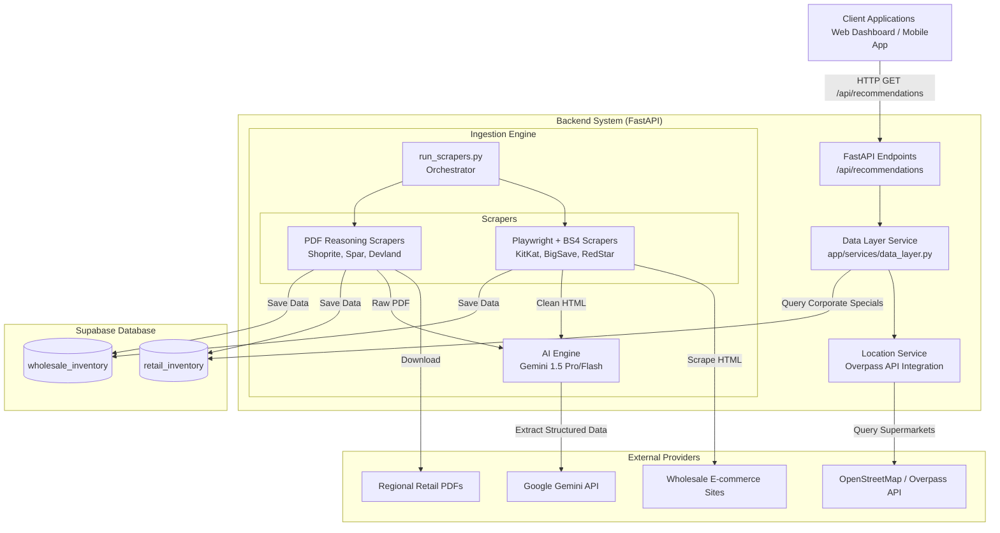
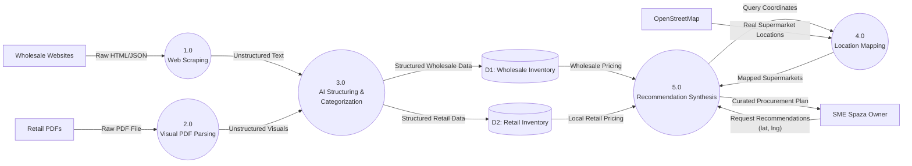

# Retail Intelligence System (RIS) Architecture

This document provides a high-level overview of the system architecture and data flow for the Retail Intelligence System (RIS).

## System Architecture

The RIS architecture is designed to harvest, process, store, and serve retail and wholesale intelligence. It uses a modern Python-based backend to orchestrate web scraping, visual reasoning, and geographic data aggregation.

> [!NOTE]
> The backend decouples the **Ingestion Pipeline** (which runs asynchronously or via a cron job) from the **Serving Pipeline** (FastAPI) to ensure that the user-facing dashboard remains fast and responsive.

 

## Data Flow Diagram (DFD)

The Data Flow Diagram illustrates how information moves from raw external sources, gets transformed by our AI engine, is persisted, and is finally synthesized into actionable intelligence for SMEs.

> [!TIP]
> **Process 3.0 (AI Structuring & Categorization)** is the core intelligence layer. Instead of fragile CSS selectors, we pass raw HTML/PDFs to Gemini. It structurally identifies the `item`, normalizes the `price`, determines the `category` (e.g., *Wholesale Staples*, *Toiletries*), and generates an `estimated_markup_potential`.

### Key Components Explained:
- **Ingestion Orchestrator (`run_scrapers.py`)**: Responsible for clearing old tables and kicking off scrapers.
- **AI Engine (`ai_engine.py`)**: Uses `google-generativeai`. It uses two distinct strategies: `extract_products_from_html` and `extract_products_from_pdf_url`.
- **Location Service (`location_service.py`)**: Dynamically queries OpenStreetMap nodes tagged with `shop=supermarket` to anchor the retail prices to a physical competitor near the SME.
- **Data Layer (`data_layer.py`)**: Synthesizes the data. It binds the physical locations (from Overpass) to the retail catalog (from Supabase) to deliver an exact "what your local competitors are charging" report.
